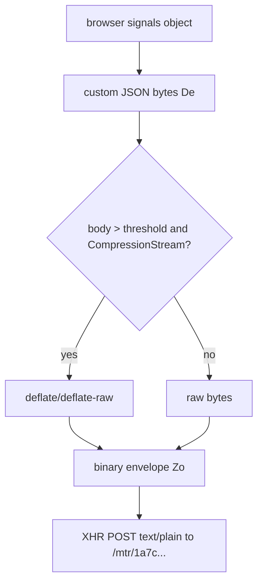

# PayPal `dfp.js` / MTR 生成链路静态分析文档

> 样本：`/home/nonewhite/paypal-pay/captures/roxy-paypal-20260705-103548/js/00006_resp_200_script_www.paypalobjects.com_v15170r-1d3n71ph1c4710n_dfp.js_e5d12d0aac.js`  
> SHA256：`e5d12d0aac6c1ccd279fc733f5e31842938c890faf46b4c2451019b87e17510c`  
> 原始大小：`180576` bytes  
> 美化副本：`/tmp/paypal_dfp_analysis/dfp.terser.js`，`7244` 行  
> 基线抓包：`/home/nonewhite/paypal-pay/captures/roxy-paypal-20260705-103548`

## 1. 结论摘要

`dfp.js` 不是简单“拼参数再 POST”的脚本。它内置了一套 FingerprintJS/PayPal DFP 风格的采集引擎，流程是：

1. 从页面读取 `window.PAYPAL.dfpData` 或 `<script id="dfpconfig">`。
2. 组装 MTR endpoint：
   - 主 POST endpoint：`/mtr/1a7c3460cd8c343771081839499ed7a0?...`
   - TLS / bootstrap endpoint：`/mtr/1a7c3460cd8c343771081839499ed7a0/AvQ9/Gr6-8k/ViQEi/xLu1/x0`
3. 先请求 x0 endpoint，返回一个短 base64 token，作为请求体里的 `s56` / TLS 信号输入之一。
4. 运行多阶段浏览器信号采集模块：`id`、`bd`、`si`，以及一个本地 event/history 模块。
5. 把采集结果汇总成一个结构化对象。
6. 将结构化对象序列化为 JSON bytes，必要时压缩，然后套一层自定义 binary envelope。
7. 用 XHR `POST` 到 `/mtr/1a7c...`，`Content-Type: text/plain`，body 是二进制数据。
8. 服务端返回 JSON，包含 `requestId`、`sealedResult`、`products`。
9. 脚本触发 `dfp-completed-check` 事件，并写入 `sessionStorage` 去重标记。

真实抓包中的 MTR POST body 不是 `dfpconfig` 的直接编码，也不是固定模板；它包含大量运行时采集结果、随机 request id、时序、iframe/性能事件和 x0 bootstrap 结果。

## 2. 页面输入与抓包观测

### 2.1 页面内配置

真实 HTML 中可见：

```json
{
  "dfpChannel": "iwc-mxo",
  "clientMetaDataId": "BA-37R61061EU582084R",
  "isQA": false,
  "fppAPIKey": "QBzalmMuDFJIiZNebIWt"
}
```

来源位置通常是：

- `window.PAYPAL.dfpData`，优先级最高；或
- `<script id="dfpconfig" type="application/json">...</script>`。

### 2.2 真实 MTR 请求

GET bootstrap：

```text
GET https://www.paypal.com/mtr/1a7c3460cd8c343771081839499ed7a0/AvQ9/Gr6-8k/ViQEi/xLu1/x0?q=QBzalmMuDFJIiZNebIWt
```

GET 响应：`96` bytes，内容是 base64 字符串，例如以：

```text
s+7ltUQKtn0tpAci...
```

开头。

POST：

```text
POST https://www.paypal.com/mtr/1a7c3460cd8c343771081839499ed7a0?chnl=iwc-mxo&cmid=BA-37R61061EU582084R&cr=undefined&btz=Pacific/Honolulu&emf=true&ci=js/3.12.1&q=QBzalmMuDFJIiZNebIWt
Content-Type: text/plain
```

POST body：`3236` bytes，SHA256：

```text
5b762d02ae66bdc98d98bba8a2ca3837aefeb49e6320ec03022b5fe9cdb39b61
```

POST 响应字段：

| 字段 | 类型 | 说明 |
|---|---|---|
| `v` | string | 协议版本，样本为 `2` |
| `requestId` | string | 服务端本次识别请求 ID，样本长度 `20` |
| `sealedResult` | string | 服务端密封结果，样本长度 `2892` |
| `products` | object | identification 等产品结果 |

## 3. 入口逻辑

美化后关键入口位于 `/tmp/paypal_dfp_analysis/dfp.terser.js` 约 `6910-7244` 行。

入口做了这些事：

1. 初始化 Beaver logger：
   - URL：`/identity/di/log`
   - prefix：`DFPJS`
   - flushInterval：`7000ms`
   - sendBeacon：启用
2. 记录：
   - `LIB_LOADED`
   - `EDGE_MAPPING_ENABLED`
3. 读取配置：
   - `fppAPIKey`
   - `dfpChannel`
   - `clientMetaDataId`
   - `csrfNonce`
   - `isQA`
4. 获取浏览器时区：
   - `Intl.DateTimeFormat().resolvedOptions().timeZone`
5. 计算 endpoint。
6. 检查是否已完成 DFP。
7. 如果可运行，调用内部采集引擎 `di(...)`。

## 4. eligibility / 去重判断

函数 `Cs(...)` 负责判断是否继续执行。条件包括：

| 条件 | 说明 |
|---|---|
| `dfpData` 存在 | 没有配置则记录 `INELIGIBlE:DFPDATA_MISSING` |
| `apiKey` 存在 | 没有 `fppAPIKey` 则记录 `INELIGIBlE:API_KEY_MISSING` |
| `clientMetaDataId` 存在 | 用作 `cmid` |
| URL intent 合法 | 允许 `signin`、`connect`、`checkout`、`prox`、`nativewebsso` |
| 非 `cgi-bin/webscr` | webscr session 被标记为不合格 |
| 当前 cmid 未完成 | `sessionStorage[4g3-fd7gc5k5]` 不能已经是 `true` |

去重相关 key：

```text
4g3-fd7gc5k5
4g3-fd7gc5k5-CMID
```

如果 sessionStorage 里已完成并且 CMID 一致，脚本只派发：

```text
dfp-completed-check
```

不会重复提交 MTR。

如果已完成但 CMID 不一致，会记录 `DIFF_CMID` 并清理旧标记。

## 5. endpoint 构造

生产环境下：

```text
POST /mtr/1a7c3460cd8c343771081839499ed7a0
  ?chnl=<dfpChannel>
  &cmid=<clientMetaDataId>
  &cr=<csrfNonce or undefined>
  &btz=<Intl timezone>
  &emf=true
  &ci=js/3.12.1
  &q=<fppAPIKey>
```

TLS/bootstrap endpoint：

```text
GET /mtr/1a7c3460cd8c343771081839499ed7a0/AvQ9/Gr6-8k/ViQEi/xLu1/x0?q=<fppAPIKey>
```

`isQA=true` 时 endpoint 会变为空字符串或 non-prod 路径，本样本 `isQA=false`。

## 6. 采集引擎 `di(...)`

`di(...)` 是核心采集引擎。它接收：

```text
apiKey
region = us
modules = [id, bd, si, _o()]
endpoint = MTR POST URL
tlsEndpoint = MTR x0 URL
```

内部返回一个 agent 对象，主要暴露：

```text
get()
collect()
```

入口最终调用的是：

```text
o.get()
```

### 6.1 模块结构

入口配置了三类主模块：

| 模块 key | 作用概括 |
|---|---|
| `id` | 识别类信号，包含 URL、referrer、cookie/visitor token、canvas/webgl/audio/navigator 等 |
| `bd` | bot detection 类信号，包含自动化、headless、环境异常、WebDriver、插件、运行时一致性等 |
| `si` | session/integration 类信号，样本里主要包含 `s77` |
| `_o()` | 本地事件历史/visibility/请求生命周期记录器 |

每个模块按 stage 分层：

| stage | 特征 |
|---|---|
| `stage1` | 早期可同步采集或缓存准备 |
| `stage2` | 异步/中等成本采集，常和 iframe、TLS、WebGPU、permissions 等有关 |
| `stage3` | 主要浏览器环境指纹，包含大量 navigator/screen/canvas/webgl/audio 等信号 |

## 7. 信号类别梳理

下面按可读静态分析结果归类。脚本内部信号名大多是 `sXX` 编号，具体语义由函数体判断。

### 7.1 浏览器/引擎族检测

脚本检测多个浏览器特征组合：

- Chromium 系：`webkitPersistentStorage`、`webkitTemporaryStorage`、`navigator.vendor`、`BatteryManager`、`webkitMediaStream` 等。
- Safari 系：`ApplePayError`、`WebKitMediaKeys`、`navigator.vendor` 等。
- Firefox 系：`buildID`、`MozAppearance`、`CSSMozDocumentRule` 等。
- IE/Edge Legacy 系：`MSCSSMatrix`、`msSetImmediate`、`msIndexedDB`、`MSStream` 等。
- 新 API 组合：`OffscreenCanvas`、`CompressionStream`、`Array.fromAsync`、`String.prototype.isWellFormed`、`WebGL2RenderingContext`、`ImageBitmap`、`ClipboardItem`、`PerformanceEventTiming` 等。

这些组合不是单个 UA 字符串能覆盖的；它们用于判断“UA 声称的浏览器”和真实 JS runtime 是否一致。

### 7.2 Navigator / window 基础字段

采集项包括：

- `navigator.userAgent`
- `navigator.appVersion`
- `navigator.connection.rtt`
- `navigator.plugins.length`
- `navigator.productSub`
- `navigator.mimeTypes` 原型链一致性
- `navigator.language`
- `navigator.languages`
- `navigator.vendor`
- `navigator.deviceMemory`
- `navigator.hardwareConcurrency`
- `navigator.pdfViewerEnabled`
- `navigator.onLine`
- `window.outerWidth/outerHeight/innerWidth/innerHeight`
- `window.external.toString()`
- `window.process` 是否存在
- `window.chrome`、`window.safari`、`window.__firefox__`、`window.oprt` 等浏览器品牌对象

### 7.3 screen / viewport / media query

采集项包括：

- `screen.width/height`
- `screen.availWidth/availHeight/availTop/availLeft`
- `screen.colorDepth`
- fullscreen 状态影响下的可用区域
- `matchMedia`：
  - `inverted-colors`
  - `forced-colors`
  - `prefers-contrast`
  - `prefers-reduced-motion`
  - `prefers-reduced-transparency`
  - `dynamic-range`
  - `color-gamut`
  - `monochrome`

### 7.4 Canvas

脚本创建 canvas，并执行两类绘制：

1. 几何/winding 测试：使用 `isPointInPath(..., "evenodd")`。
2. 文本和图形渲染：
   - 固定文字包含 emoji 和多字体绘制。
   - 使用 `fillRect`、`fillText`、透明填充、`globalCompositeOperation=multiply`、圆形路径等。
   - 通过 `toDataURL()` 取结果。

返回结果会区分：

- `unsupported`
- `unstable`
- 实际 data URL 派生值

### 7.5 WebGL

脚本会创建 `webgl` / `experimental-webgl` context，采集：

- `VERSION`
- `VENDOR`
- `RENDERER`
- `SHADING_LANGUAGE_VERSION`
- `WEBGL_debug_renderer_info` 下的 unmasked vendor/renderer
- context attributes
- getParameter 列表
- supported extensions
- extension parameters
- shader precision formats
- unsupported extensions

这些字段与 GPU、驱动、ANGLE、浏览器版本高度相关。

### 7.6 Audio

脚本使用：

- `OfflineAudioContext` / `webkitOfflineAudioContext`
- oscillator：`triangle`
- dynamics compressor
- rendering 后取 buffer 部分样本并求绝对值总和
- `AudioContext.baseLatency`

Audio 输出受浏览器、系统、采样率和实现细节影响。

### 7.7 Fonts / DOM layout

脚本通过隐藏 iframe 和 DOM span 测量字体宽度。基准字符串类似：

```text
mmMwWLliI0fiflO&1
```

它会比较：

- serif
- sans-serif
- monospace
- system-ui
- Apple system font
- 不同 font size

这类测量依赖真实布局引擎、字体栈和操作系统字体。

### 7.8 Storage / cookie

采集和使用：

- `sessionStorage`
- `localStorage`
- `document.cookie`
- 本地 visitor token / prior visitor id 缓存
- DFP 完成标志
- CMID base64 缓存

### 7.9 Permissions / Notification

脚本检查：

- `window.Notification`
- `navigator.permissions`
- `permissions.query({name:"notifications"})`
- `Notification.permission` 与 permission state 是否异常组合

### 7.10 自动化 / headless / bot 检测

显式检测的标记包括：

- `webdriver`
- Selenium 系字段
- PhantomJS / NightmareJS / WebDriverIO / CEF / CefSharp / Awesomium 等标记
- `domAutomation`
- `$cdc_...` ChromeDriver 标记
- `window.process`
- 特定 document/window 属性
- 原型链和函数 `toString()` 一致性
- 错误栈格式

### 7.11 Adblock / DOM blocker

脚本内置大量 selector 列表，用隐藏 DOM 元素检测：

- EasyList
- AdGuard
- Fanboy
- ABP regional lists
- cookie/annoyance list

它通过元素是否被 CSS 阻断来推断 blocker 环境。

### 7.12 WebGPU / 高级图形计时

样本中包含 WebGPU 检测链：

- `navigator.gpu`
- adapter/device 获取
- shader module / render pipeline / texture / timestamp query
- buffer mapping

这部分输出会受 Chrome 版本、GPU、驱动、权限和平台支持影响。

### 7.13 Performance / timing / visibility

采集项包括：

- `performance.timeOrigin`
- `performance.now()`
- document visibility 状态序列
- request lifecycle 事件时间
- resource timing 近似匹配
- get/collect 调用开始和结束时间

## 8. TLS / x0 bootstrap

`ys(...)` 是 TLS/bootstrap 采集函数，入口配置为模块 `id` 的 `tls`。

流程：

1. 根据 `tlsEndpoint` 生成 endpoint list。
2. 给 endpoint 附加 `q=<apiKey>`。
3. 通过 XHR GET 请求 x0 endpoint。
4. 校验响应：
   - HTTP 200
   - body 匹配 base64 正则
   - 长度不超过约 `1022` 字符
5. 返回结构：

```text
{s: 0, v: <x0 base64>}
```

这个结果随后进入主请求体字段，静态上对应 `s56` / TLS 字段。

## 9. MTR POST body 的生成

### 9.1 结构化对象构建

`To(...)` 负责构建主请求结构。核心字段包括：

| 字段 | 说明 |
|---|---|
| `c` | API key，即 `fppAPIKey` |
| `t` | tag/custom tag |
| `cbd` | extended result 标志 |
| `lid` | linked id |
| `a` | algorithm 标识 |
| `m` / `l` | integration metadata |
| `ec` | expose components 标志 |
| `mo` | module key 列表，如 `id`、`bd`、`si` |
| `pr` | products |
| `s56` | TLS/x0 bootstrap 结果 |
| `s67` | custom component |
| `sc` | current script URL / stack source |
| `uh` | URL hash/strip 配置 |
| `gt` | get 调用标志 |
| `ab` | AB test selection |
| `hu` | request id / repeat visit hint |
| `ri` | request id |
| `sXX` | 各浏览器信号输出 |

### 9.2 URL 和 referrer 处理

模块 `id.toRequest(...)` 会取：

- `location.href`
- `document.referrer`

并根据 url hashing 设置对 path/query/fragment 做 SHA-256 哈希或 strip，避免直接提交完整敏感 URL。

### 9.3 序列化

脚本不直接用 `JSON.stringify()` 字符串作为 POST body，而是：

1. 自定义 JSON serializer：`De(...)`。
2. 输出 UTF-8 bytes。
3. 如果 body 大于阈值且浏览器支持 `CompressionStream`，会压缩：
   - 优先 `deflate-raw`
   - fallback `deflate`
4. 套自定义 envelope：`Zo(...)`。
5. envelope 内部包含：
   - 固定 marker
   - 随机填充
   - 随机 key/seed
   - payload 与随机 bytes 的混合/异或式封装
6. 最终通过 XHR 发送二进制 body。

简化流程图：



### 9.4 网络发送

实际发送函数位于 `Uo(...)` / `$o(...)` / `Zr(...)` 链：

- method：`POST`
- header：`Content-Type: text/plain`
- `withCredentials: true`
- responseFormat：`binary`
- XHR transport

响应收到后，脚本尝试解 envelope、解析 JSON，再交给 `br(...)` 处理。

## 10. 响应处理

`br(...)` 解析服务端响应。它期望响应体结构类似：

```text
v = "2"
requestId
sealedResult
products.identification.data
```

如果存在 `products.identification.data`，返回：

```text
{
  requestId,
  sealedResult,
  ...identification.result
}
```

如果产品数据缺失，则返回 fallback 结构，但仍可能带 `requestId` / `sealedResult`。

`id.onGetResponse(...)` 还会把服务端返回的 `visitorToken` 写入本地 cookie/localStorage 辅助缓存。

## 11. 完成事件和 sessionStorage

MTR 成功返回后：

1. 派发：

```text
dfp-completed-check
```

payload：

```json
{"cmid":"BA-...","dfpCompleted":true}
```

2. 记录：

```text
VENDOR_RESPONSE_RECEIVED
EDGE_MAPPING_COMPLETE
```

3. 写入：

```text
sessionStorage["4g3-fd7gc5k5"] = true
sessionStorage["4g3-fd7gc5k5-CMID"] = btoa(cmid)
```

注意：当前样本中 `emf=true`，所以成功后走 `EDGE_MAPPING_COMPLETE`，不会调用 `/identity/di/store/pre`；如果 `emf=false` 或 non-prod/旧路径，才会尝试 `store/pre` 临时记录。

## 12. 为什么 happy-dom 只能跑出“形状相似”的 body

`dfp.js` 采集的数据严重依赖真实 Chromium runtime。happy-dom 能提供 DOM 形状，但缺失或需要手工 patch 的部分包括：

| 领域 | 真实脚本依赖 | happy-dom 问题 |
|---|---|---|
| Canvas | text、emoji、composite、toDataURL | 通常是 stub 或非真实渲染 |
| WebGL | GPU/ANGLE/extension/precision | 需要手工伪造，难以和 UA/OS/driver 一致 |
| Audio | OfflineAudioContext、compressor render | Node DOM shim 没有真实音频管线 |
| Fonts/layout | iframe + span measurement | 没有真实字体栈和布局引擎 |
| Permissions | Notification/permissions.query | 需要 patch，状态组合容易异常 |
| WebGPU | adapter/device/shader/timestamp | 通常不存在或无法真实执行 |
| Performance | timeOrigin、resource timing、event loop | 与 Chrome 调度和 waterfall 不一致 |
| Storage/cookie | browser cookie jar/sessionStorage/localStorage | 与真实页面生命周期割裂 |
| CSP/security event | securitypolicyviolation、XHR behavior | 与真实浏览器安全模型不同 |
| Automation flags | 原型链、函数 toString、error stack | patch 后仍难匹配 Chromium |

因此 happy-dom 可以触发 `dfp.js` 的 XHR 分支并生成一个 binary body，但这个 body 的内部信号不是同一真实 Chrome runtime 的自然输出。

## 13. 对当前项目的含义

当前项目里的 `automation_vs_real_browser_risk_diff.md` 把 MTR `sealedResult` 缺失列为最高优先级差异。通过本次静态分析可以确认：

1. `sealedResult` 是服务端基于 MTR POST body 返回的密封结果。
2. POST body 由真实浏览器环境中的大量 API 输出共同决定。
3. `dfpconfig` 只提供 channel/cmid/apiKey 等入口参数，不足以纯协议生成可信 body。
4. Python 直接模板化 FraudNet/Tealeaf/FPTI 的思路不适合 MTR。
5. 若追求“真实等价”，应让真实 Chromium 执行 `dfp.js` 并自然发送 MTR，而不是用 happy-dom 模拟。

## 14. 建议的后续研究方式

用于诊断/验证时，可以采用以下非伪造方向：

1. 用 CDP/Playwright 监听真实浏览器页面：
   - `Network.requestWillBeSent`
   - `Network.responseReceived`
   - `Runtime.consoleAPICalled`
   - `Page.lifecycleEvent`
2. 对 `/mtr/1a7c...` 设置 XHR breakpoint，观察调用栈。
3. 只记录：
   - endpoint
   - request body 长度和 hash
   - response `requestId` 长度
   - `sealedResult` 是否存在和长度
   - `dfp-completed-check` 事件是否派发
4. 将真实 Chrome 的 MTR 出现时间，与 FraudNet/FPTI/Tealeaf/Datadog waterfall 对齐。

## 15. 关键函数索引

| 位置 | 函数/逻辑 | 作用 |
|---|---|---|
| `~980` | logger 初始化 | `/identity/di/log`、`LIB_LOADED` |
| `~1001` | `u(...)` | `/identity/di/store/pre` fallback |
| `~2438` | `br(...)` | 解析服务端响应，提取 `requestId` / `sealedResult` |
| `~2646` | `Dr(...)` | URL/referrer 哈希处理 |
| `~2681` | `Fr(...)` | 给 endpoint 拼 query |
| `~2705` | `Zr(...)` | XHR transport 调度 |
| `~3320` | `To(...)` | 汇总请求对象 |
| `~3390` | `Wo(...)` | CompressionStream 压缩 |
| `~3420` | `Zo(...)` | binary envelope 包装 |
| `~3450` | `Uo(...)` | POST 请求 orchestration |
| `~3735` | `li(...).get()` | agent get 主流程 |
| `~3895` | `di(...)` | fingerprint agent 初始化 |
| `~6763` | `ys(...)` | x0 TLS/bootstrap GET |
| `~6945` | `Cs(...)` | eligibility 判断 |
| `~6970` | 入口 IIFE | 读取 dfpconfig、构造 endpoint、调用 `di(...).get()` |

## 16. 抓包样本对照

| 项 | 值 |
|---|---|
| `dfp.js` SHA256 | `e5d12d0aac6c1ccd279fc733f5e31842938c890faf46b4c2451019b87e17510c` |
| x0 GET body length | `96` bytes |
| MTR POST body length | `3236` bytes |
| MTR POST body SHA256 | `5b762d02ae66bdc98d98bba8a2ca3837aefeb49e6320ec03022b5fe9cdb39b61` |
| MTR response `requestId` length | `20` |
| MTR response `sealedResult` length | `2892` |
| session flag | `4g3-fd7gc5k5` |
| cmid storage key | `4g3-fd7gc5k5-CMID` |
